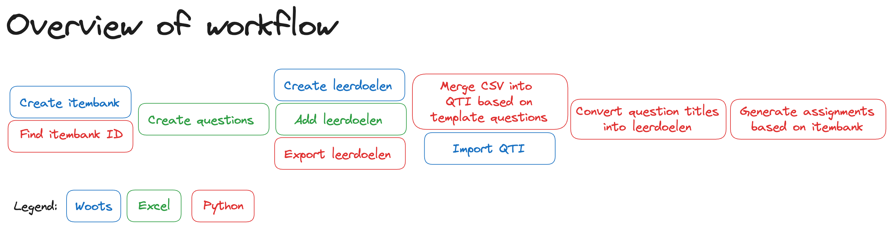

# Itembank Generation in Woots: a CSV to QTI + API approach

*This repo contains questions.csv for only 2 chapters of one year, due to copyright reasons. 
If you have access to Noorhoff Grandes Lignes, please contact us with a request to help you get all years and chapters.*

## What, why, how?

### What you can do with it?
Generate an [itembank](https://support.woots.nl/hc/nl/articles/4404659857937-Wat-is-een-itembank-) to import in [Woots](https://www.woots.nl/), based on the French learning material of Grandes Lignes 6th edition by Wolters Noordhoff for classes 1, 2 and 3 havo/vwo.

### Why we did it?
To boost the usage of digital examinations for students (with Woots), because we believe in many advantages. 

We (some teachers at Emmauscollege Rotterdam) didn't want to perform the same clicks over and over again for each new question we created, so we decided to automate it.

### How we built it
The Woots API does not support "correctiemodel" (scoring rubric, criteria) and QTI export/import does not support "leerdoelen" (objectives). 

That is why we ended up using a combination of importing script-generated QTI files and the Woots API.

Alternative: a tool that does automated clicking/typing. We didn't look into this.

## How to use

1. Create an itembank in Woots
   1. Login to Woots website https://app.woots.nl/ and create an itembank
   2. Add labels "Geïmporteerd" and set is to default (itembank -> nstellingen -> labels), this will allow you to prevent accidental modification of all imported questions by adding "toetsbeschermingsregels" and "opgavebeschermingsregels" after al questions and assignments have been imported.
   3. `export WOOTS_API_TOKEN_="putyourtokenhere"`, a token can be created at https://app.woots.nl/users/tokens
   2. Set variable `school_id` and `item_bank_name` in script `findItembankID.py`
   3. run `python findItembankID.py`, the question_bank_id must be used in other scripts
  
2. Create an `questions.xlsx` file with one question per row.
   1. download questions from Noordhoff site (multiple files per chapter)
   2. Rearrange all files in such a way that all info about one question is on one line in one file. 
   3. Save the final result in `questions.xlsx`
   
3. Add leerdoelen to `questions.xlsx`
   1. Create leerdoelen in the itembank
   2. `export WOOTS_API_TOKEN_="putyourtokenhere"`, you have generated this token in step 1 above
   2. Set variable `question_bank_id` in script,  you have found this id in step 1 above
   3. Run `python exportLeerdoelenToCSV.py`
   4. Copy-paste the output of the script (leerdoelen table) to `questions.xlsx`
   5. Add the leerdoelen to each question, using formulas in `questions.xlsx`
   6. Save the tab with all questions from the Excel file to `questions.csv`
   
4. Merge questions with template questions
   1. Basic: Use the example `export.zip` with template questions in QTI format
      Advanced: create your own template questions in Woots and export as QTI to export.zip, some linenumbers in the export are hard codes in our script (we know this is ugly)
   2. Use `python mergeCSVIntoQTI.py` to generate many questions
   3. Import generated QTI file `import.zip` in Woots 
   4. The maximum number of questions in the `import.zip` qti-file that can be imported in woots is 5000. In case you go beyond this limit, split the `questions.csv` into multiple files and repeat previous steps.

5. Add leerdoelen to questions in Woots
   1. `export WOOTS_API_TOKEN_="putyourtokenhere"`, you have generated this token in step 1 above
   1. Set variable `question_bank_id` in script, you have found this id in step 1 above
   2. Run `python convertQuestionTitlesToLeerdoelen.py`

6. Create assignments
   1. `export WOOTS_API_TOKEN_="putyourtokenhere"`, you have generated this token in step 1 above
   1. Set variable `question_bank_id` in script, you have found this id in step 1 above
   2. Set variables `part1_intro_excercise_id`, `part2_intro_excercise_id` and `part3_intro_excercise_id` in script. These exercises contain no question but solely an explanation inserted before each part of the assignment. The exercises must be created in the itembank using the webinterface in Woots.
   3. NB: remove directory `__repoxxxxx_exercises__` to read exercises from api instead of cache
   4. Run `python createItembankAssignments.py`

## Limitations
- Questions from paragraph C and G (pcc and pcg files) have not been imported. Because they are more diverse and less used in exams, we did not bother to take import them for now.
- Questions of the type "fill" are limited to 8 correct answers. In case the Noordhoff source contains more than 8 correct answers, additional answers will be ignored. This limitation follows from our choice to limit the number of columns for correct answers in de `questions.xlsx` to 8.
- Questions of the type "multiple choice" have a fixed number of 4 answers, one of which is correct. In case the Noordhoff source deviates from this, additional (correct) answers will be ignored.
- More limitations can be found in the README tab of the questions.xlsx file

## Documentation
- You can run these scripts online using Gitpod, a free account can be created, more info on Gitpod is here  
  https://www.gitpod.io/docs
- REST APIs in Python  
  https://realpython.com/api-integration-in-python/#rest-and-python-consuming-apis
- Woots API reference (requires login to Woots)  
  https://app.woots.nl/api/docs/index.html
- How to create a token for Woots API  
  https://support.woots.nl/hc/nl/articles/8422631132689-Genereer-een-API-token
   
## Other links you might find interesting
- Convert Markdown to QTI
  https://pypi.org/project/text2qti/

## Disclaimer
Use at your own risk! The authors are teachers, not programmers.

Do not save your token or any other private information in files, as you don't want those to become public.

